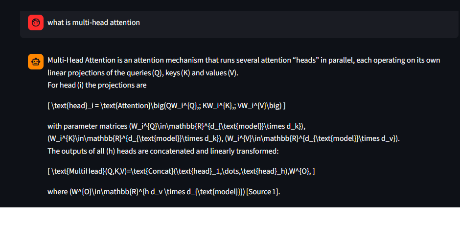
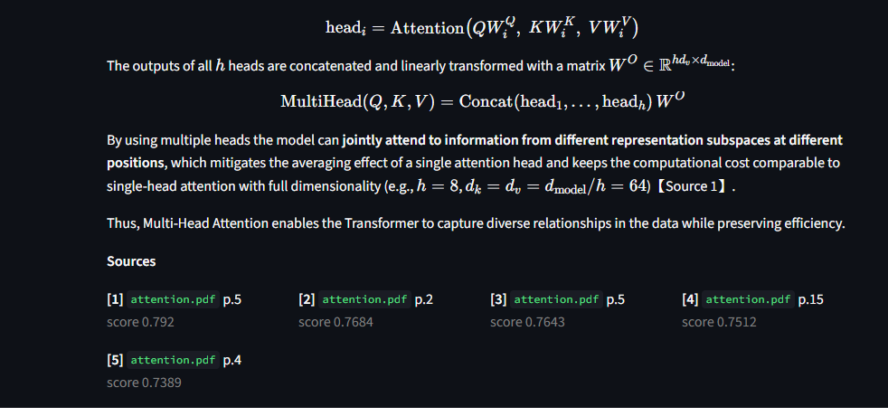

# 🧠 DocuMind

**RAG-based PDF Q&A with live evaluation metrics.**

Ask questions about your PDFs. Get grounded answers with citations *and* quantitative quality scores — not just vibes.


---

## Why this exists

Most RAG demos stop at *"it returned an answer."* DocuMind goes further: every response is scored on **faithfulness**, **answer relevance**, and **context precision** so you can actually tell whether the pipeline is working — and where it's failing.

## Screenshots




## Architecture

```
                ┌─────────────┐
   PDF files ──▶│  ingest.py  │  extract + chunk (RecursiveCharacterTextSplitter)
                └──────┬──────┘
                       │
                       ▼
              ┌────────────────┐
              │  sentence-     │  local embeddings (all-MiniLM-L6-v2)
              │  transformers  │
              └────────┬───────┘
                       │
                       ▼
              ┌────────────────┐
              │    Chroma      │  persistent vector store (cosine)
              └────────┬───────┘
                       │
   user query ────────▶│
                       ▼
              ┌────────────────┐
              │ retriever.py   │  top-k semantic search
              └────────┬───────┘
                       │
                       ▼
              ┌────────────────┐
              │ generator.py   │  Groq LLM (openai/gpt-oss-120b)
              └────────┬───────┘
                       │
                       ▼
              ┌────────────────┐
              │ evaluator.py   │  LLM-as-judge: faithfulness,
              │                │  relevance, context precision
              └────────┬───────┘
                       │
                       ▼
              ┌────────────────┐
              │   app.py       │  Streamlit UI + dashboard
              └────────────────┘
```

## Quickstart

```bash
# 1. Clone and install
git clone https://github.com/ahmedilyas614csm-oss/documind.git
cd documind
python -m venv .venv
source .venv/Scripts/activate     # Windows
# source .venv/bin/activate       # macOS/Linux
pip install -e ".[dev]"

# 2. Add your Groq API key (free tier)
cp .env.example .env
# edit .env → GROQ_API_KEY=gsk_...
# get a key at https://console.groq.com/keys

# 3. Run
streamlit run app.py
```

Then upload a PDF in the sidebar, or click **Ingest sample PDFs** to use the bundled paper.

## Tech stack

| Layer | Choice | Why |
|---|---|---|
| PDF parsing | `pypdf` | Pure Python, no poppler dependency |
| Chunking | `langchain-text-splitters` | Recursive splitting respects paragraph boundaries |
| Embeddings | `sentence-transformers` (all-MiniLM-L6-v2) | Local, ~90MB, no API key, no network |
| Vector store | `chromadb` | Embedded, persists to disk, zero setup |
| Generation | Groq `openai/gpt-oss-120b` | Free tier, fast inference |
| Evaluation | Groq LLM-as-judge | Reproducible, no separate service |
| UI | Streamlit | Python-only, instant dashboard |

## Evaluation metrics

Every query is scored on three axes. All metrics return a float in `[0, 1]`.

| Metric | What it measures | How it's computed |
|---|---|---|
| **Faithfulness** | Are the answer's claims supported by the retrieved context? | LLM judge breaks the answer into claims and checks each against the chunks |
| **Answer relevance** | Does the answer address the question? | 40% embedding cosine similarity + 60% LLM judge |
| **Context precision** | What fraction of retrieved chunks were actually useful? | LLM judge rates per-chunk usefulness |

**Known limitation:** LLM-as-judge has a self-preference bias — the same model family that wrote the answer tends to score itself highly. Production systems address this with a different judge model, human spot-checks, or reference-based metrics (RAGAS, BERTScore). Noted as future work.

## Project layout

```
documind/
├── .github/workflows/ci.yml     # pytest + ruff on every push
├── .vscode/                     # VS Code debug configs + recommended extensions
├── .streamlit/config.toml       # quiet Streamlit, disable file watching
├── src/documind/
│   ├── config.py                # pydantic-settings — all tunables in one place
│   ├── ingest.py                # PDF → chunks → embeddings → Chroma
│   ├── retriever.py             # query → top-k nearest neighbors
│   ├── generator.py             # retrieved chunks + query → grounded answer
│   ├── evaluator.py             # faithfulness, relevance, precision
│   └── pipeline.py              # one clean entry point for the UI/CLI
├── tests/                       # pytest suite
├── app.py                       # Streamlit UI
├── pyproject.toml               # PEP 621 packaging
└── data/sample_pdfs/            # demo corpus
```

## Design notes

- **Config via `pydantic-settings`.** Every tunable (chunk size, top-k, model name) is externalized to `.env`. When Groq retires a model — which happens often — you change one line, not the code.
- **Local embeddings, API only for generation.** Embeddings are the cheapest, most frequent operation. Running them locally means the free Groq tier lasts 10× longer and the app works offline.
- **Chroma client is a module-level singleton.** Streamlit re-executes the script on every interaction; instantiating Chroma repeatedly in one process triggers a known settings-parsing bug.
- **Deterministic chunk IDs.** Chunks are hashed from `(source, page, text)`, so re-ingesting the same PDF updates rather than duplicates.
- **Evaluation is first-class, not an afterthought.** The dashboard is in the app, not a separate notebook — because in production, quality measurement is a feature, not a research task.

## Running the tests

```bash
pytest -v          # all tests
ruff check src tests   # lint
```

Tests don't hit the network — they exercise the pure logic (chunking, similarity conversion, judge-output parsing).

## License

MIT